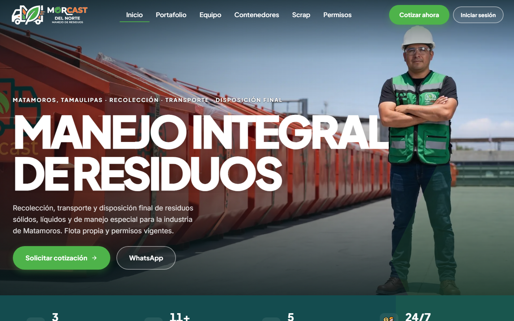
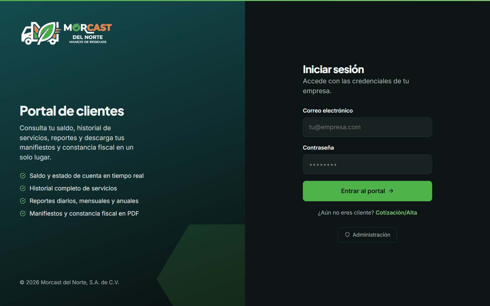
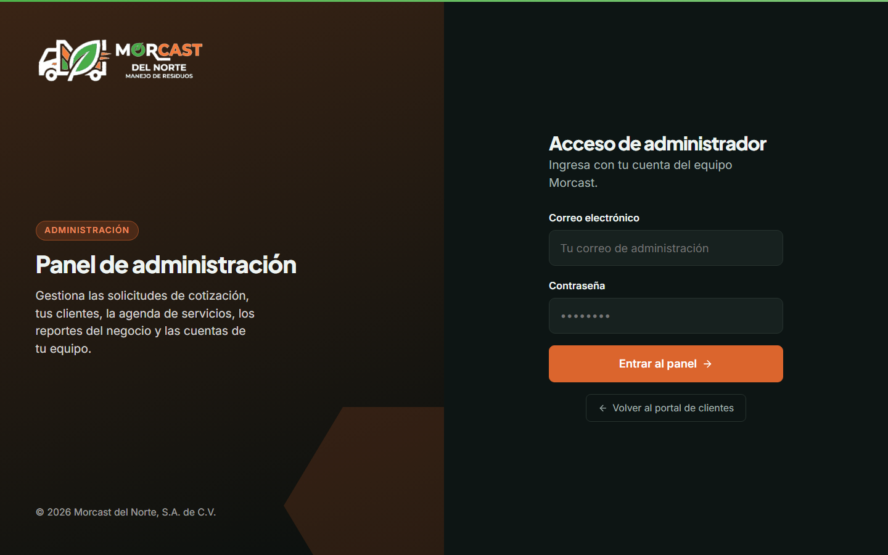

# Morcast del Norte

**Manejo integral de residuos en Matamoros, Tamaulipas.** Sitio web + portal de clientes + panel de administración + modo chofer + app móvil.

🌐 **En vivo: [morcast.mx](https://morcast.mx)**



---

## Qué es

Una plataforma completa para la empresa: la **web pública** que capta clientes, un **portal** donde cada cliente ve su saldo, historial y descarga sus manifiestos, un **panel de administración** para gestionar el negocio, un **modo chofer** para el operador en la calle, y la misma experiencia en **app móvil** (Android e iPhone).

| Módulo | Para quién | Qué hace |
|---|---|---|
| 🌐 **Web pública** | Prospectos | Servicios, contenedores, scrap, permisos, cotización y WhatsApp |
| 📝 **Cotización / Alta** | Prospectos | Formulario público que revisa la cobertura real y avisa a la oficina por correo |
| 👤 **Portal de clientes** | Clientes | Saldo en tiempo real, historial, reportes y PDF (manifiestos, constancia) |
| 🛠️ **Panel de administración** | Equipo Morcast | Solicitudes, altas, clientes, agenda, saldos, rutas, bitácora y usuarios |
| 🚛 **Modo chofer** | Operadores | Escanea el QR del contenedor y toma foto antes/después de recolectar |
| 📱 **App móvil** | Todos | Todo lo anterior, nativo, en Android e iPhone |

<table>
<tr>
<td width="50%"><b>Portal de clientes</b><br></td>
<td width="50%"><b>Panel de administración</b><br></td>
</tr>
</table>

---

## Accesos demo

| Rol | Dónde entra | Correo | Contraseña |
|---|---|---|---|
| Cliente | [morcast.mx/portal/login](https://morcast.mx/portal/login) | `cliente@demo.com` | `0011002` |
| Chofer | [morcast.mx/chofer/login](https://morcast.mx/chofer/login) | `chofer@demo.com` | `0011002` |
| Administración | [morcast.mx/admin/login](https://morcast.mx/admin/login) | `morcastmx@gmail.com` | *(se entrega directo a la empresa)* |

> Son cuentas de demostración con datos inventados. **La contraseña de administración
> no se documenta aquí**: se entrega a Morcast por separado.
>
> ⚠️ **`cliente@demo.com` es la cuenta que usa el revisor de Google Play.** No se
> borra ni se le cambia la contraseña mientras la app esté en revisión.

---

## Cómo correrlo

**Web** (en `Web/`):

```bash
npm install
npm run dev        # http://localhost:3000
```

**App móvil** (en `App IOS/` o `App Android/`):

```bash
npm install
npx expo start     # se escanea con Expo Go
```

Cada carpeta necesita su archivo de variables de entorno (`Web/.env.local`,
`App IOS/.env`, `App Android/.env`). **No van a git**; viajan aparte.

---

## Estructura del repo

```
Web/              # Web + portal + panel + chofer (EN VIVO en morcast.mx)
  app/            #   páginas y acciones de servidor
  lib/            #   acceso a datos, sesiones, PDF, correo
  db/             #   migraciones SQL numeradas (001 → 010)
App Android/      # App móvil con el proyecto nativo de Android generado
App IOS/          # Mismo código, ajustes propios de iOS
respaldo/         # Respaldo de la base y prueba de restauración
docs/             # Manuales, cuaderno de captura y material de tiendas
desplegar-rapido.sh
```

**Stack:** Next.js 16 · React 19 · Bootstrap 5 (web) · Expo / React Native SDK 54 (móvil) · Supabase — PostgreSQL, autenticación y archivos.

---

## Operación

| Tarea | Cómo |
|---|---|
| **Publicar cambios** | `./desplegar-rapido.sh` — compila local, sube y reinicia. ~1 minuto |
| **Respaldar la base** | `node respaldo/respaldar.mjs` — base + archivos + manifiesto con firmas |
| **Probar que el respaldo sirve** | `node respaldo/probar-restauracion.mjs` — lo restaura en un Postgres temporal y compara |
| **Migraciones** | Los `.sql` de `Web/db/` se aplican en orden con `psql` |

Un respaldo que nunca se ha restaurado no es un respaldo. Por eso el script de
prueba existe y hay que correrlo de vez en cuando.

---

## Documentación

| Documento | Para quién |
|---|---|
| [`docs/manual-empresa.md`](docs/manual-empresa.md) | El personal de Morcast: cómo se usa cada pantalla del panel |
| [`docs/manual-tecnico.md`](docs/manual-tecnico.md) | Quien mantiene el sistema: piezas, despliegue, seguridad y trampas conocidas |
| [`docs/tiendas/`](docs/tiendas/) | Material para publicar la app: ficha, guía paso a paso y política de privacidad |
| [`docs/MORCAST - Cuaderno de captura.xlsx`](docs/MORCAST%20-%20Cuaderno%20de%20captura.xlsx) | Lo que Morcast llena para entregarnos sus rutas, clientes y recolecciones |

---

## Estado

**En producción:** web, portal, panel, modo chofer y las tres rutas con su zona de
cobertura. Los respaldos corren y ya se probó que restauran.

**En proceso:** publicar la app en Google Play. El `.aab` está compilado y todo el
material listo; falta que Google apruebe la cuenta de la empresa.

**Pendiente:** ambiente de pruebas separado del sitio en vivo, encender la CSP en
modo bloqueo, y los datos que faltan de Morcast — precios reales, RFC, datos
bancarios y por dónde pasan de verdad las rutas.

---

## Créditos

La mayor parte de este sistema la escribió **[@jsamuelglz00](https://github.com/jsamuelglz00)**.
Este repositorio empieza con el historial aplastado en un solo commit, así que
el registro de quién hizo qué no viaja en `git log`; queda anotado aquí.

---

<p align="center"><sub>© 2026 Morcast del Norte, S.A. de C.V.</sub></p>
